## Outline

1. The problem: visualizing large node-weighted trees

2. Our solution: Maximum entropy summary trees

3. Going from "code that works for me" to an R package

4. Miscellaneous thoughts

  

- This is joint work with Howard Karloff.
- The `summarytrees` R package is hosted at [https://www.github.com/kshirley/summarytrees](https://www.github.com/kshirley/summarytrees).

<!--
## Exploratory Analysis of Large Trees

- Lots of interesting data is tree-structured:
    + Company organizational charts
    + Phylogenetic trees
    + Computer file systems
    + Genealogy trees
    + URLs
    + Various categorization schemes:
        + stocks
        + webpages
        + products on shopping websites

## Exploratory Analysis of Large Trees

- Lots of interesting data is tree-structured:
    + Company organizational charts (salary)
    + Phylogenetic trees
    + Computer file systems (file sizes in bytes)
    + Genealogy trees
    + URLs (# of clicks/unique visitors)
    + Various categorization schemes:
        + stocks (market cap) 
        + webpages
        + products on shopping websites (sales, prices, ratings, etc.)

- Often, the nodes naturally have non-zero weights associated with them.

>- If not, setting all weights = 1 encodes the structure of the tree

>- Question: How do we learn about the structure of a (potentially large) node-weighted tree?
-->

## Motivating Example: DMOZ (the Open Directory Project)

- DMOZ is one of the largest directories of websites in the world (although it may be a bit dated...)

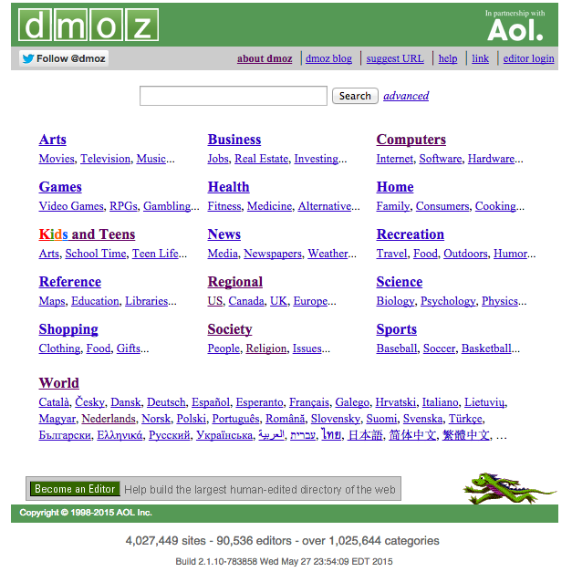

## Motivating Example: DMOZ (the Open Directory Project)

- Data is available for download at [http://www.dmoz.org/rdf.html](http://www.dmoz.org/rdf.html).

- As of April, 2015, there were about 3.7 million unique URLs listed in the directory, belonging to about 595,000 unique topics (excluding the Kids and Teens branch).

- The topics are organized into a hierarchy.

- Question: What is the distribution of URLs over this topic hierarchy?

## Some Summary Statistics

<pre>                                                                                                                              Topic Frequency
1                                    Top/Arts/Animation         6
2                   Top/Arts/Animation/Anime/Characters         6
3      Top/Arts/Animation/Anime/Clubs_and_Organizations        31
4                 Top/Arts/Animation/Anime/Collectibles        10
5            Top/Arts/Animation/Anime/Collectibles/Cels        12
...                                                 ...       ...
595001             Top/World/Uyghurche/Rayonluq/Yawropa         3
595002                     Top/World/Uyghurche/Référans         5
595003                   Top/World/Uyghurche/Salametlik         1
595004                        Top/World/Uyghurche/Sport         1
595005                        Top/World/Uyghurche/Xewer         5
</pre>

- Representing this data as a node-weighted tree, we have $n = 635,855$ total nodes in the tree (40,000 internal nodes with weight = 0 were added to the 595,000 nodes with weight > 0).

- The total weight (# of URLs) of the tree is $W = 3,776,432$.

- The maximum depth of the tree is 15.

- The range of node weights is $[1, 1276]$.

## Distribution of URLs aggregated to Level 2

- One solution is aggregating the nodes.

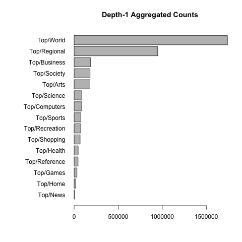

>- Problem: the distribution of aggregated weights across the children of the root is heavily skewed.

>- We'd naturally like to drill down into the largest nodes, and perhaps group the small ones into a cluster called "other".

## Drilling down into Top/World...

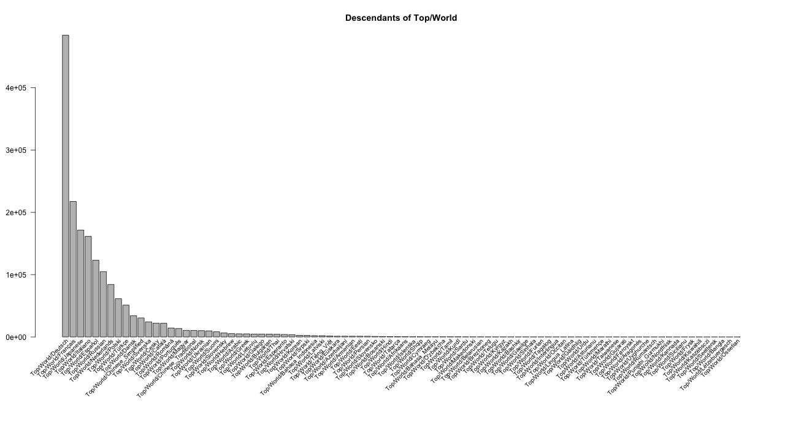

## Drilling down into Top/World...

- ... we see the same thing: a heavily skewed distribution with a long tail.

>- The central problem (<i>across many real-world trees</i>):
> To visualize all the children of a node using a layered layout, we waste space on lots of inconsequential nodes.

>- (Quick note on treemaps -- yes, they are compact in space, but they don't always do a good job of showing the hierarchy of a tree).

>- The solution: aggregate nodes flexibly at different levels of the tree, and allow aggregation of a subset of children under each parent.

>- This leads to our definition of a <i>summary tree</i>.

## Preview of Solution

## Outline

1. The problem: visualizing large node-weighted trees

2. Our solution: Maximum entropy summary trees

3. Going from "code that works for me" to an R package

4. Miscellaneous thoughts

## The defintion of a summary tree
- Suppose this is the input tree, containing 9 nodes:

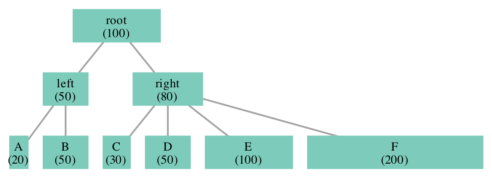

## The defintion of a summary tree
- A node in a summary tree can represent an entire subtree of the original tree.

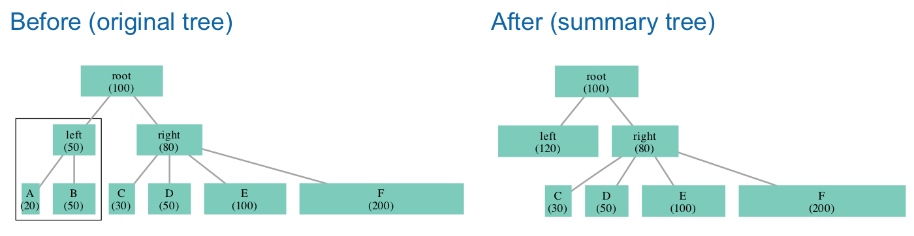

## The defintion of a summary tree

- A node of a summary tree can represent at most one cluster of children under each parent (and all the descendants of those children).

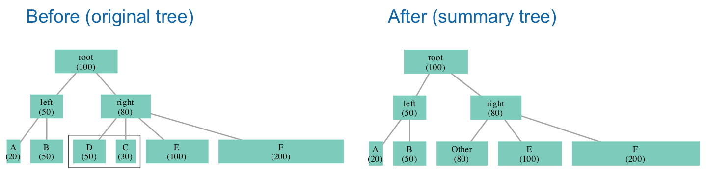

## The defintion of a summary tree

- A node of a summary tree can represent at most one cluster of children under each parent (and all the descendants of those children).

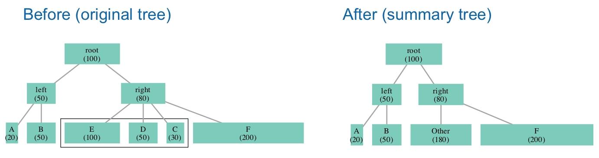

## The defintion of a summary tree

- A node of a summary tree can represent at most one cluster of children under each parent.

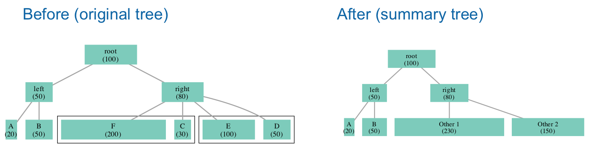

>- Not a summary tree!

## Maximum entropy summary trees

- Among all summary trees with the same number of nodes, which is the best?
- Define the entropy of a node-weighted tree as the entropy of the discrete probability distribution defined by the normalized node weights.

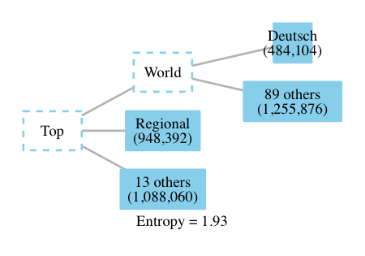
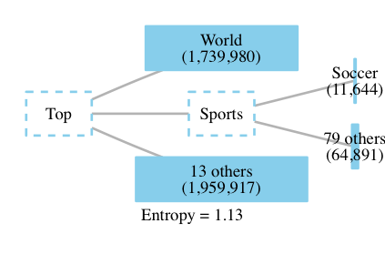

- Both are 6-node summary trees of the DMOZ tree, but one has much higher entropy.
- If 6 nodes is your "budget", the left summary tree is more informative.

## Algorithms:

- Use dynamic programming to compute the maximum entropy summary tree with $k$ nodes for all $k = 1, 2, ..., K$, for some user-defined $K$ (we often set $50 \leq K \leq 200$).
- Algorithm 1: "Optimal"
    + The exact solution runs in $O(nK^2W)$, where $n$ is the number of nodes and $W$ is the sum of the weights, which must be integers.
    + The approximation algorithm gets within $\epsilon$ of the maximum entropy by scaling down weights and rounding.
- Algorithm 2: "Greedy"
    + a greedy heuristic that searches only part of the solution space, but does very well in practice. Runs in $O(nK^2)$.

## Output:

- A series of $K$ summary trees. We use a layered layout for plots but this isn't required (computation is independent of vis layout).

- The <i>entropy profile</i> of the tree. Simply the plot of entropy as a function of the number of nodes in the maximum entropy summary tree:
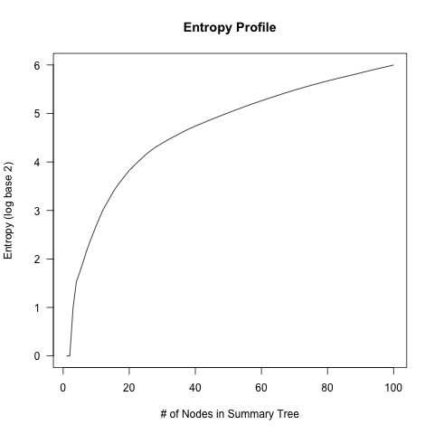

- A key benefit: There are no tuning parameters here, making it a good default method. The vector of maximum entropies for $k = 1, ..., K$ is essentially a summary statistic of the input tree.

## The end of the project... or is it?
- Wrote a paper (Karloff and Shirley, EuroVis 2013)

- Wrote code to implement the algorithm on enough examples to support the paper

- Generated a few static plots (for the paper and associated website)

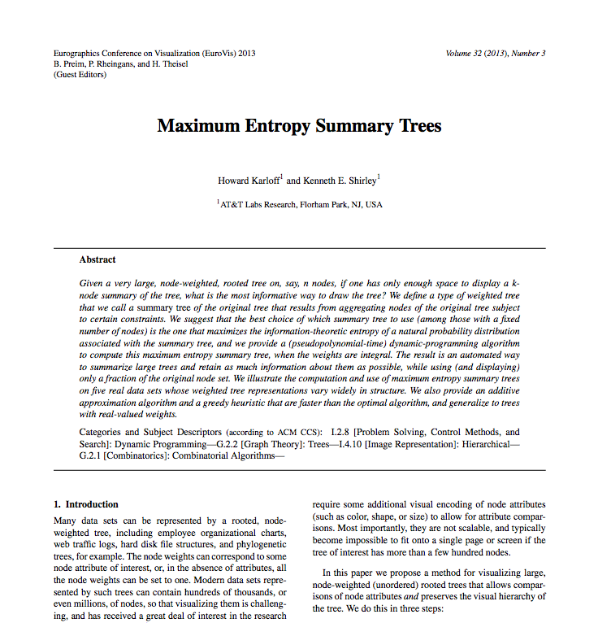

## The end of the project... or is it?
- Wrote a paper (Karloff and Shirley, EuroVis 2013)

- Wrote code to implement the algorithm on enough examples to support the paper

- Generated a few static plots (for the paper and associated website)

## The end of the project... or is it?
- Wrote a paper (Karloff and Shirley, EuroVis 2013)

- Wrote code to implement the algorithm on enough examples to support the paper

- Generated a few static plots (for the paper and associated website)

>- then...

>- ...

>- ...

>- (crickets chirping)

>- ...

>- nothing happened.

## Outline

1. The problem: visualizing large node-weighted trees

2. Our solution: Maximum Entropy Summary Trees

3. Going from "code that works for me" to an R package

4. Miscellaneous thoughts

## How to make this an R package

- Original workflow was:
    + R code to read, manipulate, prepare data
    + R code for computation (super slow)
    + R code to spit out Graphviz code
    + Graphviz to produce a series of  (K = 100) pdf files.

## How to make this an R package

- Original workflow was:
    + R code to read, manipulate, prepare data
    + ~~R~~ C code for computation (~~super slow~~ 100x faster)
    + R code to spit out Graphviz code
    + Graphviz to produce a series of (K = 100) pdf files

## How to make this an R package

- Original workflow was:
    + R code to read, manipulate, prepare data
    + ~~R~~ C code for computation (~~super slow~~ 100x faster)
    + R code to ~~spit out Graphviz code~~ write JSON data to disk
    + ~~Graphviz~~ d3.js to produce ~~a series of (K = 100) pdf files~~ a single interactive web-based graphic.

## How to make this an R package

- Original workflow was:
    + R code to read, manipulate, prepare data
    + ~~R~~ C code for computation (~~super slow~~ 100x faster)
    + R code to ~~spit out Graphviz code~~ write JSON data to disk
    + ~~Graphviz~~ d3.js to produce ~~a series of (K = 100) pdf files~~ a single interactive web-based graphic.
    + Wrap this all up into an R package, `summarytrees`

## Using the `summarytrees` package:

1. Read in your data as a "list of edges": 
    + 4 variables: node ID, parent ID, (non-negative) weight, and label.
    + To-do: accept nested JSON-formatted trees, other formats?

2. Do the computation (with K = 100 for example):
    + `optimal(..., K = 100, epsilon = 0)` for the exact algorithm
    + `optimal(..., K = 100, epsilon > 0)` for the approximation algorithm
    + `greedy(..., K = 100)` for the greedy algorithm
    + All of them return the list of K summary trees as output

3. Call `prepare.vis()` to set plotting options, such as node colors, the sizes of various plotting elements, etc.

4. Call `draw.vis()` to open a browser and locally serve the visualization from a temporary directory on your machine using the `servr` package.

The package has vignettes, and some of this will change over time, most likely.

<!--
## `summarytrees` 1: Data Input

- Data is expected to follow a 4-column data.frame with a column for node ID, parent ID, (non-negative) weight, and label.
- In real life data comes in different formats, but for now we require users to coerce it to the above format, which could be called "list of edges".

## Data formats

- Nested JSON (example: `flare` file system, from https://gist.github.com/mbostock/1093025):
<pre>
{
 "name": "flare",
 "children": [
  {
   "name": "analytics",
   "children": [
    {
     "name": "cluster",
     "children": [
      {"name": "AgglomerativeCluster", "size": 3938},
      {"name": "CommunityStructure", "size": 3812},
      {"name": "HierarchicalCluster", "size": 6714},
      {"name": "MergeEdge", "size": 743}
     ]
    },
    {
     "name": "graph",
     "children": [
      {"name": "BetweennessCentrality", "size": 3534},
      {"name": "LinkDistance", "size": 5731},
</pre>

## Data formats

- List of nodes with full path
 <pre>
/src/flare$ tree -ifs
.
[        204]  ./analytics
[        204]  ./analytics/cluster
[       3938]  ./analytics/cluster/AgglomerativeCluster.as
[       3812]  ./analytics/cluster/CommunityStructure.as
[       6714]  ./analytics/cluster/HierarchicalCluster.as
[        743]  ./analytics/cluster/MergeEdge.as
[        238]  ./analytics/graph
[       3534]  ./analytics/graph/BetweennessCentrality.as
[       5731]  ./analytics/graph/LinkDistance.as
 </pre>

## Data formats

- List of edges (child-parent)
<pre>
> flare[1:10, ]
  child parent weight                 label
1     1      0      0                 flare
2     2      1      0             analytics
3     3      2      0               cluster
4     4      3   3938  AgglomerativeCluster
5     5      3   3812    CommunityStructure
6     6      3   6714   HierarchicalCluster
7     7      3    743             MergeEdge
8     8      2      0                 graph
9     9      8   3534 BetweennessCentrality
10   10      8   5731          LinkDistance
</pre>

## `summarytrees` 2: Computation

- Compute the maximum entropy summary trees using either:
    + `greedy()`, the greedy heuristic (very fast)
    + `optimal(..., epsilon = 0)`, the exact algorithm (slow for large weights and requires integer weights)
    + `optimal(..., epsilon > 0)`, the approximation to the exact algorithm, which returns an answer that is guaranteed to be close to optimal.
- The output is a list of node-weighted trees with $k = 1, 2, .., K$ nodes, each of which is a $k$-node summary tree of the input tree. We recommend $50 \leq K \leq 200$ in most cases.

- You can always "drill down", or "zoom in" by re-setting the root to an internal node of the tree.

<pre>
g <- greedy(node = dmoz[, "node"],
            parent = dmoz[, "parent"],
            weight = dmoz[, "weight"],
            label = dmoz[, "label"],
            K = 100)
</pre>

## `summarytrees` 3: Preparing the visualization

- Call `prepare.vis()` to set plotting options, such as node colors, the sizes of various plotting elements, etc. 

<pre>
json <- prepare.vis(tree.list = g$summary.trees,
                    labels = g$data[, "label"],
                    tree = g$tree,
                    legend.width = 150,
                    node.width = 225,
                    node.height = 12,
                    units = "# of URLs",
                    print.weights = TRUE,
                    legend.color = "lightsteelblue",
                    color.level = 2)
</pre>

## `summarytrees` 4: Serving the visualization

- Call `draw.vis()` to open a browser and locally serve the visualization from a temporary directory on your machine using the `servr` package.

<pre>
draw.vis(json.object = json,
         out.dir = tempfile(),
         open.browser = interactive())
</pre>
-->

## Examples:

- DMOZ

- Math Genealogy

- R Source code

## Comparison to Collapsible Tree

- Collapsible trees are a very nice d3.js example from Mike Bostock: http://bl.ocks.org/mbostock/4339083.

- The function d3.layout.tree() implements the Reingold-Tilform algorithm for a nice-looking layered layout of nodes and links of a tree.

- The collapsible tree allows for expanding/collapsing children of nodes.

- Maximum entropy summary trees are less flexible, but come with nice properties of their own.

- Think of them as a very strictly-guided tour of the structure of a node-weighted tree (rather than allowing one to explore with complete freedom).

## Outline

1. The problem: visualizing large node-weighted trees

2. Our solution: Maximum Entropy Summary Trees

3. Going from "code that works for me" to an R package

4. Miscellaneous thoughts

## The Good

- The algorithms work and d3.js is slick and fun!

- Take an R list, use toJSON(list), and scoop it up in javascript with d3.json().

- Interesting challenge with summary tree transitions:
    + Maximum entropy summary trees are not nested!
    + Example: The 34 and 35-node maximum entropy summary trees for the DMOZ data only share 32 nodes in common.
    + Solution: send the union of all tree nodes to the browser and look up most recent common ancestor between the $k_\text{old}$-node summary tree and the $k_\text{new}$-node summary tree to determine entry and exit locations for transitions.

## The Bad

- Need better data input options (accept JSON, for example, rather than just list of edges)
- Need better error checking (make sure the input is a tree!) and testing
- Need to find a home for the entropy profile in the d3.js plot
- Most importantly: Need to leverage the R ecosystem and community!
    + Tree data manipulation: `jsonlite`, `dendrogram()` (h/t Tal Galili, author of `dendextend`), `ape` (focus on phylogenetic trees), others?
    + R-to-d3.js workflow: `htmlwidgets`, `rCharts`, `networkD3`
    + Data: `rotl` (R Open Tree of Life), others?

## The Ugly

- Calling C from R using .C and `capture.output()`
<pre>
tmp <- capture.output(.C("Roptimal", R_K = as.integer(K), 
        R_n = as.integer(n), R_numparents = as.integer(numparents), 
        R_epsilon = as.double(epsilon), R_weight = as.double(data[, 
            "weight"]), R_childindex = as.integer(childindex), 
        R_childstart = as.integer(childstart), 
        R_childend = as.integer(childend), 
        PACKAGE = "summarytrees"))
</pre>
>- Lesson: Don't be macho with your co-developers about your data manipulation skills.

>- Echoing similar statements from R community members Hilary Parker and Hadley Wickham, among others:   

>- <i>If you decide to organize your code as an R package, the sooner you do it the better!</i>

## Thanks

Thanks!

Acknowledgements: Thanks to Carson Sievert and Carlos Scheidegger for tips and discussion on d3.js

kshirley@research.att.com

[github.com/kshirley](https://github.com/kshirley)

[twitter.com/kennyshirley](https://twitter.com/kennyshirley)

R `summarytrees` package at Github: [kshirley/summarytrees](https://github.com/kshirley/summarytrees/tree/master)
